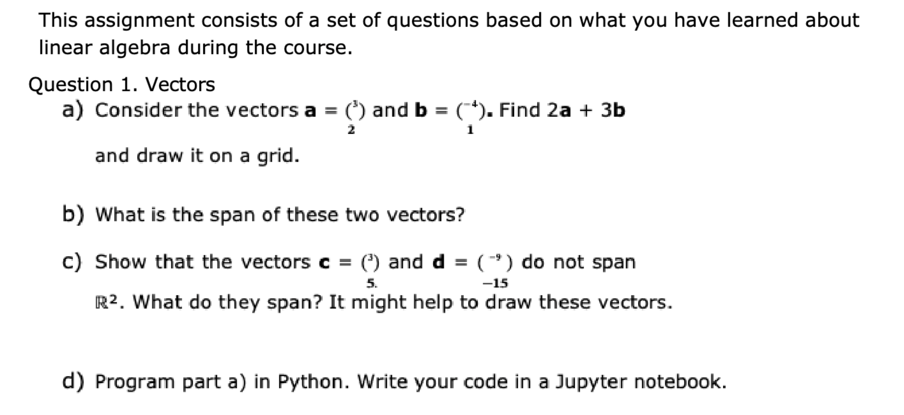

# ifcs2-seminar2-tk

This is a summative 1 AND 2 coursework sample with some code snippets.

## Introduction

>Brief description of your workplace environment, including
justification for suitability of your proposed EMS for your workplace environment.

### My introduction idea

I work for a startup that makes a health and safety training application.

In today's fast-paced workplace, online meetings have become an integral part of our daily routines. With the increasing number of virtual gatherings, it is crucial to streamline the registration process to ensure accurate attendance records and punctuality data.

To address this need, I propose the development of a tkinter-based application that will allow to register participants during online meetings as well as learn ho simple Python apps work. It will be used via replit during training meetings and all the user is asked to do is write their names.

## My Design

