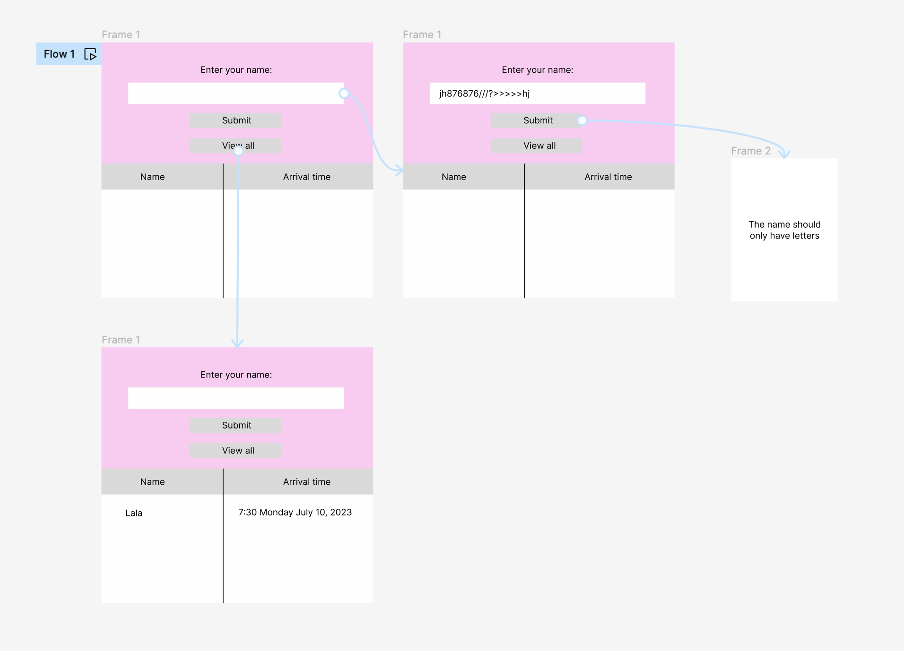

# ifcs2-seminar2-tk

This is a summative 1 AND 2 coursework sample with some code snippets.

## Introduction

>Brief description of your workplace environment, including
justification for suitability of your proposed EMS for your workplace environment.

### My introduction idea

I work for a startup that makes a health and safety training application.

In today's fast-paced workplace, online meetings have become an integral part of our daily routines. With the increasing number of virtual gatherings, it is crucial to streamline the registration process to ensure accurate attendance records and punctuality data.

To address this need, I propose the development of a tkinter-based application that will allow to register participants during online meetings as well as learn ho simple Python apps work. It will be used via replit during training meetings and all the user is asked to do is write their names.

## My Design



## My Prototypes

[Here you can see my Figma](https://www.figma.com/file/sH1WBYnw3AmW8dPWVR86ID/ifcs2-sum1-sample?type=design&node-id=0-1&mode=design&t=VhXcxQBfjVhnYihc-0)

[Clickable proto](https://www.figma.com/proto/sH1WBYnw3AmW8dPWVR86ID/Untitled?type=design&node-id=1-2&t=VhXcxQBfjVhnYihc-0&scaling=min-zoom&page-id=0%3A1&starting-point-node-id=1%3A2)

## Code coverage (optional)

>This is an extra resource for people who aare interested in writingg just enough unit tests (Summative 2).

Code coverage refers to a metric used in software development to measure the extent to which the source code of a program has been executed during testing. It provides insights into the percentage of code lines, branches, or statements that have run by a test suite or set of tests.

Some student developers take pride in getting 100% code cov. In real life, however, too many tests slow the pipeline down so 100% is not considered necessary. All in all, it is a subject of a lot of debate in Software Theory, feel free to cover this debate using [the library](https://library.northeastern.edu/) and published sources (Summative 2).

To use Python `coverage` option make sure your project is in a folder. Navigate to the folder in a terminal. For windows you may need to use different commands.

To install `coverage`

```bash
pip3 install coverage
```

or

```bash
pip install coverage
```

To run the coverag report

```bash
coverage run -m unittest test_app.py
```

To print coverage

```bash
coverage report -m  
```